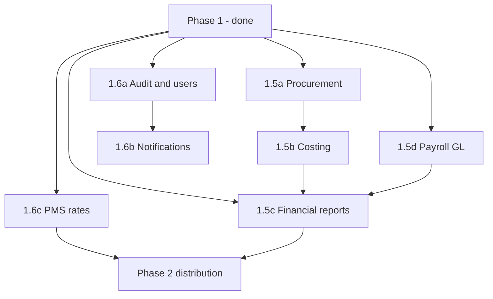

# ERP completeness roadmap

Path from **Phase 1 hospitality operations platform** (current) to a **complete hospitality ERP** with full finance, supply chain, and enterprise controls.

## Current state (Phase 1 — complete)

| Module | Scope | Doc |
|--------|-------|-----|
| Settings | Orgs, branches, inventory pools, audit log, team & roles | [settings-module.md](./settings-module.md) |
| PMS | Rooms, guests, reservations, rates, housekeeping | [pms-module.md](./pms-module.md) |
| POS | Menu, orders, kitchen, payments | [pos-module.md](./pos-module.md) |
| Inventory | Ledger, movements, weighted-average costing, recipes/BOM, pools | [inventory-module.md](./inventory-module.md) |
| Procurement | Vendors, POs, receive → stock + AP journal | — |
| Accounting | CoA, manual journals, PMS/POS/payroll auto-posting | [accounting-module.md](./accounting-module.md) |
| HR | Employees, attendance, staff meals, payroll runs | [hr-module.md](./hr-module.md) |
| Payroll | Async runs, GL journals, PDF payslip | [hr-module.md](./hr-module.md) § Payroll |
| Reporting | Dashboard metrics, operational + financial CSV exports | [reporting-module.md](./reporting-module.md) |
| Notifications | In-app bell; email via Resend when `RESEND_API_KEY` is set | — |

**Still a stub:** `integrations` (health check only).

**Optional / Phase 2:** PropelAuth email invite (join-code flow is the MVP), rate-plan room+F&B packages, fiscal periods & period close.

---

## Target definition: “Complete hospitality ERP”

A property group can run **end-to-end** without spreadsheets for:

1. **Guest & F&B operations** — rooms, POS, kitchen (done)
2. **Supply chain** — buy → receive → stock → consume → COGS
3. **Finance** — double-entry GL, AP/AR, payroll journals, period close, statutory-ready reports
4. **People** — HR lifecycle, payroll, compliance artifacts
5. **Governance** — audit trail, role admin, alerts

Distribution features (OTA, mobile, offline POS) improve competitiveness but are **not required** for the ERP label.

---

## Roadmap overview

```
Phase 1 (done)     Operations ERP MVP
       │
       ▼
Phase 1.5          Finance & supply chain core  ← closes the ERP loop
       │
       ▼
Phase 1.6          Platform & control plane
       │
       ▼
Phase 2            Distribution & scale         ← existing backlog
```

| Phase | Theme | Est. | Outcome |
|-------|-------|------|---------|
| **1.5a** | Procurement | 3–4 weeks | Vendors, POs, receiving → inventory + AP |
| **1.5b** | Inventory costing | 1–2 weeks | Real COGS from weighted-average cost |
| **1.5c** | Financial reporting | 2–3 weeks | Trial balance, P&L, balance sheet |
| **1.5d** | Payroll → GL | 1 week | Salary expense / payable journals |
| **1.6a** | Audit & users | 2 weeks | AuditLog writes, admin UI for members/roles |
| **1.6b** | Notifications | 1–2 weeks | Email/in-app alerts for ops events |
| **1.6c** | PMS rates | 2–3 weeks | Rate plans, seasons, packages |
| **Phase 2** | Distribution | 12–16 weeks | See [phase2/README.md](./phase2/README.md) |

**Total to “complete ERP” (Phases 1.5 + 1.6):** ~12–16 weeks after Phase 1 soak.

---

## Phase 1.5 — Finance & supply chain core

### 1.5a Procurement module

**Why:** Without PO → receive → pay, inventory and AP stay disconnected from real purchasing.

**Entities**

| Model | Purpose |
|-------|---------|
| `Vendor` | Supplier master (org-scoped): name, contact, payment terms, default AP account |
| `PurchaseOrder` | Header: vendor, branch, status, expected date, total |
| `PurchaseOrderLine` | Item/SKU, qty, unit price, received qty |
| `GoodsReceipt` | Links PO line → `InventoryMovement` (PURCHASE / IN) |

**Statuses (text, not PG enum):** `DRAFT` → `SUBMITTED` → `PARTIALLY_RECEIVED` → `RECEIVED` → `CLOSED` | `CANCELLED`

**API surface:** `/procurement/vendors`, `/procurement/purchase-orders`, `/procurement/receipts`

**Web UI:** `/procurement` — vendors tab, PO list/create, receive goods (partial OK)

**Accounting hooks**

- On receipt: Dr Inventory / Cr Accounts Payable (or GRNI liability if using accrual)
- On vendor payment (future 1.5c): Dr AP / Cr Cash

**Dependencies:** Inventory items (existing), Account 2000 AP (seeded), branch scoping

**Acceptance criteria**

- [ ] Create vendor and PO with lines referencing inventory SKUs
- [ ] Receive partial qty → stock increases, PO line `receivedQty` updates
- [ ] Full receive closes PO; movements appear in inventory ledger
- [ ] Journal entry created on receipt when AP + Inventory accounts exist
- [ ] E2E: create PO → receive → verify stock + movement

---

### 1.5b Inventory costing

**Why:** COGS and inventory asset values are wrong with `qty × 1`.

**Approach (Phase 1.5):** Weighted average cost per `InventoryItem` at branch level.

| Field | Location |
|-------|----------|
| `averageUnitCost` | `InventoryItem` (Decimal, maintained on each IN movement) |
| COGS calc | `sale qty × averageUnitCost` on order complete / recipe deduction |

**Rules**

- `PURCHASE` IN: recalculate average = `(oldQty × oldAvg + newQty × unitPrice) / (oldQty + newQty)`
- `ADJUSTMENT` IN with price: same formula
- OUT movements: consume at current average; no average change on OUT

**Accounting:** Replace placeholder COGS amount in `order.completed` and recipe listeners.

**Dependencies:** 1.5a (receipts supply unit price); works without PO using manual PURCHASE + unit price field

**Acceptance criteria**

- [ ] Item shows current average cost in inventory UI
- [ ] POS complete posts COGS at average × recipe qty
- [ ] Unit tests for average recalc edge cases (zero stock, first purchase)

---

### 1.5c Financial reporting

**Why:** Journals exist but there is no GL view — accountants cannot close a period.

**Report types (add to `/reporting/types` + CSV/PDF later)**

| Code | Output |
|------|--------|
| `trial_balance` | Account code, name, debit balance, credit balance |
| `profit_and_loss` | Revenue − expense by account for date range |
| `balance_sheet` | Assets, liabilities, equity as of date |
| `general_ledger` | All lines for one account in range |

**API:** Reuse `POST /reporting/export` with date range params (`from`, `to`, optional `asOf`).

**Web UI:** Reports page — financial section with date pickers; link from Accounting page.

**Also in scope**

- Payroll journal report lines (after 1.5d)
- Export job types registered in `ReportJob.type`

**Dependencies:** Journal data (existing); no fiscal periods required for v1 of reports

**Acceptance criteria**

- [ ] Trial balance debits = credits for seeded data
- [ ] P&L includes room + F&B revenue from auto-posted journals
- [ ] CSV download via existing async report pipeline

**Deferred to 1.6:** Fiscal periods, period close lock, journal reversal.

---

### 1.5d Payroll → accounting

**Why:** Payroll runs complete in isolation; salary expense never hits the GL.

**On `PayrollRun` → `COMPLETED`:**

For each `PayrollLine`:

```
Dr 5100 Salary Expense     grossPay
    Cr 2100 Salary Payable     netPay
    Cr 1200 / meal deduction account   deductions   (if staff meals deducted)
```

**Also**

- Replace `.txt` placeholder with minimal PDF payslip (use existing `pdf` BullMQ queue + storage)
- Optional: single summary journal per run instead of per-employee lines (config flag)

**Dependencies:** 1.5c (reports show payroll accounts); chart accounts 5100, 2100 seeded

**Acceptance criteria**

- [ ] Payroll run creates balanced journal entry(ies)
- [ ] Accounting → Journals shows payroll reference (`referenceType: payroll_run`)
- [ ] Payslip file stored and linked from HR payroll tab

---

## Phase 1.6 — Platform & control plane

### 1.6a Audit trail & user administration

**AuditLog (schema exists)**

- Interceptor or service helper: log `action`, `entityType`, `entityId`, `metadata`, `userId`, `organizationId` on CREATE/UPDATE/DELETE for PMS, POS, inventory, accounting, HR, procurement
- Web: Settings → **Audit log** tab (ADMIN only), filter by entity/date/user

**User admin**

- API: invite user (PropelAuth), assign/change `UserOrganization.role`, deactivate membership
- Web: Settings → **Team** tab — list members, role dropdown, invite form

**Acceptance criteria**

- [ ] Sensitive actions appear in audit log within 1s
- [ ] Admin can change a user’s role without DB access

---

### 1.6b Notifications

**Replace log-only processor with real delivery.**

| Event | Channel (MVP) |
|-------|-----------------|
| Low stock (dashboard threshold) | Email + in-app |
| Payroll run completed / failed | Email to HR role |
| PO awaiting receipt (optional) | In-app |
| Report export ready | In-app (link) |

**Entities:** `Notification` (userId, title, body, readAt, link), optional `NotificationPreference`

**Web:** Header bell icon + dropdown; mark read.

**Dependencies:** Users/members (1.6a); reporting job complete event (existing)

---

### 1.6c PMS rate management

**Why:** `basePrice` on room is not enough for seasons, weekends, or packages.

**Entities**

| Model | Purpose |
|-------|---------|
| `RatePlan` | Name, room type, base modifier, date range |
| `RateRule` | Day-of-week, min stay, price override |
| `Package` | Room + F&B bundle (optional) |

**Reservation pricing:** Compute `totalAmount` from rate plan at booking time (store snapshot on reservation).

**Dependencies:** PMS (existing); feeds into channel manager (Phase 2)

**Acceptance criteria**

- [ ] Create seasonal rate plan; new reservation uses computed price
- [ ] Edit reservation dates recalculates if status allows

---

## Phase 2 — Distribution & scale (existing backlog)

Already documented — implement after Phase 1.5/1.6 soak in production.

| Feature | Doc | Notes |
|---------|-----|-------|
| Offline POS | [phase2/offline-pos.md](./phase2/offline-pos.md) | IndexedDB outbox |
| Mobile app | [phase2/mobile-app.md](./phase2/mobile-app.md) | Staff-facing |
| Channel manager | [phase2/channel-manager.md](./phase2/channel-manager.md) | OTA sync; depends on 1.6c rates |
| QR ordering | [phase2/qr-ordering.md](./phase2/qr-ordering.md) | Guest PWA |
| Multi-property analytics | [phase2/multi-property-analytics.md](./phase2/multi-property-analytics.md) | Cross-branch BI |

---

## Dependency graph



**Suggested build order:** 1.5a → 1.5b → 1.5d → 1.5c → 1.6a → 1.6b → 1.6c → Phase 2

---

## Explicitly out of scope (unless product direction changes)

| Area | Reason |
|------|--------|
| Full tax/VAT engine | Jurisdiction-specific; large effort |
| Fixed assets & depreciation | Rare for typical hotel/restaurant MVP |
| Bank feed reconciliation | Needs bank API integrations |
| Manufacturing / MRP | Wrong vertical |
| CRM / marketing automation | Guest book sufficient for Phase 1–2 |
| Multi-currency | Add when first international property onboarded |

---

## Milestone checklist

Use this to decide when to call the product a **complete hospitality ERP**:

### Finance complete
- [x] Procurement: PO → receive → stock → AP journal
- [x] Real inventory costing on all COGS postings
- [x] Trial balance, P&L, balance sheet exports
- [x] Payroll posts to GL; payslip PDF available

### Control complete
- [x] Audit log for sensitive writes (admin viewable)
- [x] Team management UI (roles, join requests)
- [x] Operational notifications (low stock, payroll, reports, PO submitted)

### Operations complete (Phase 1 + rates)
- [x] Rate plans drive reservation pricing
- [ ] (Phase 2) Channel manager imports OTA bookings

When **Finance complete** + **Control complete** are checked, the product meets the internal **complete ERP** bar for hospitality. Phase 2 items extend reach and UX, not core ERP completeness.

For **monetization and SaaS launch** (design partners, Stripe, plan limits), see [saas-launch-guide.md](./saas-launch-guide.md).

---

## Related docs

- [App workflow guide](./app-workflow-guide.md) — current module behavior
- [Phase 2 backlog](./phase2/README.md) — post-ERP distribution features
- [Architecture v1](../hospitality_erp_architecture_v1.md) — original 12-week MVP plan
