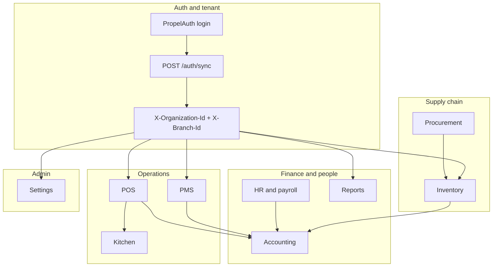
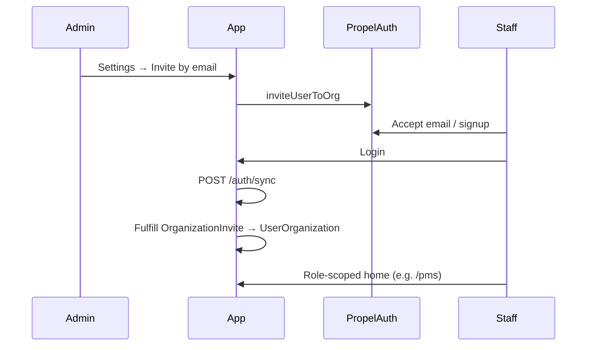
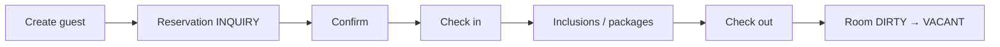
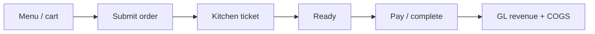
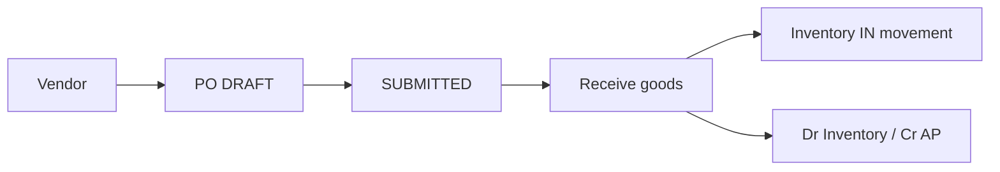
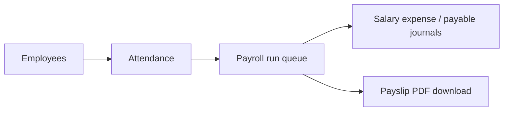
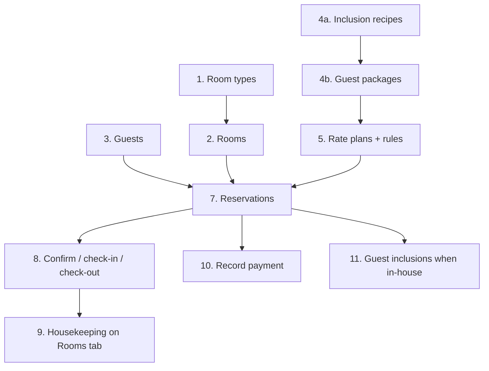

# Hospitality ERP — Visual guide

Module-by-module tour of the Phase 1 app: what each area does, how data flows, and where to go deeper.

| Source | Role |
|--------|------|
| **This doc** | Maps, journeys, screenshot index |
| **[app-workflow-guide.md](./app-workflow-guide.md)** | API steps, curl, business rules |
| **E2E specs** | `visual-guide.spec.ts` (pages), `visual-guide-flows-pms.spec.ts` + `visual-guide-flows.spec.ts` (step-by-step) |
| **Module docs** | `docs/*-module.md` |

---

## PDF export

**Printable guide (local only, not in git):** `docs/hospitality-erp-visual-guide.pdf`

```bash
pnpm test:visual-guide              # screenshots → docs/visual/screenshots/ (gitignored)
pnpm generate:visual-guide-pdf        # builds the PDF above (gitignored)
# or both:
pnpm visual-guide
```

Open the PDF after generation, or attach it to releases / email manually. Regenerate whenever the UI or this guide changes.

## Regenerate screenshots

```bash
pnpm dev   # optional — Playwright can start web-only on :3000
pnpm test:visual-guide
```

See [visual/README.md](./visual/README.md). Screenshots use **mocked API** data (consistent demo UI, not your production DB).

---

## Application map



### Sidebar modules (ADMIN view)

| Route | Module | Permission |
|-------|--------|------------|
| `/dashboard` | Overview KPIs | Dashboard access |
| `/pms` | Property management | `pms:read` |
| `/pos` | Point of sale | `pos:read` |
| `/pos/kitchen` | Kitchen display | `pos:read` |
| `/inventory` | Stock and recipes | `inventory:read` |
| `/procurement` | Vendors and POs | `inventory:read` |
| `/accounting` | CoA and journals | `accounting:read` |
| `/hr` | HR and payroll | `hr:read` |
| `/reports` | CSV exports | `reports:read` |
| `/settings` | Org, team, audit | `admin:*` |

Role-scoped users see a subset (e.g. `FRONT_DESK` → PMS only). See [organization-onboarding.md](./organization-onboarding.md).

---

## End-to-end journeys

### New staff joins the organization



Alternative: **join code** → pending request → admin approves with role ([settings Team tab](./settings-module.md)).

**E2E:** `settings.spec.ts`, `onboarding.spec.ts` · **Screenshot:** `14-settings-team.png`

---

### Guest stay (PMS)



Rate plans and F&B bundles compute `totalAmount` on book/date change (`GET /pms/pricing/quote`).

**E2E:** `pms-flow.spec.ts`, `rates.spec.ts` · **Screenshots:** `02-pms-reservations.png`, `04-pms-rates.png`

---

### Restaurant order (POS → kitchen)



**E2E:** `pos.spec.ts`, `kitchen.spec.ts` · **Screenshots:** `05-pos.png`, `06-kitchen.png`

---

### Buy stock (procurement)



**E2E:** `procurement.spec.ts` · **Screenshots:** `08-procurement-vendors.png`, `09-procurement-orders.png`

---

### Payroll



**E2E:** `hr.spec.ts` · **Screenshot:** `11-hr.png`

---

## Step-by-step form flows

Captured by Playwright into `docs/visual/screenshots/flows/{flow-name}/` (numbered `01-`, `02-`, …). **Screenshots and PDF are gitignored** — regenerate locally with `pnpm visual-guide`.

| Spec | Modules |
|------|---------|
| `visual-guide-flows-pms.spec.ts` | PMS setup + operations (order below) |
| `visual-guide-flows.spec.ts` | Procurement, inventory, POS, HR, accounting, settings, reports |

> Drawer steps crop the open form. List steps show the full page for context.

### PMS — recommended setup order

Create master data **before** reservations. Room and rate plan forms require a **room type**; rate plans can optionally attach a **guest package** (F&B bundle).



| Order | Tab | Action | Depends on |
|------|-----|--------|------------|
| 1 | **Room types** | **+ Add room type** | — |
| 2 | **Rooms** | **+ Add room** (number, type, base price) | Room type |
| 3 | **Guests** | **+ Add guest** | — |
| 4a | **Guest packages** | **+ New recipe** (meal / amenity BOM) | Inventory items (pools) |
| 4b | **Guest packages** | **+ New package** (meals/night, recipes) | Inclusion recipes |
| 5 | **Rates** | **+ Add rate plan** (room type, dates, optional package) | Room type, optional package |
| 5b | **Rates** | **Rules** on a plan row (day, min stay, price override) | Rate plan |
| 6 | **Reservations** | **+ New reservation** | Guest, room, dates (pricing quote) |
| 7 | Row actions | Confirm → Check in → Check out | Reservation status |
| 8 | **Rooms** | **→ VACANT** after checkout (DIRTY → vacant) | Checked-out room |
| 9 | Row | **Payment** | Reservation with balance |
| 10 | Row | **Inclusions** | Checked-in guest with package |

### PMS — Room type (`flows/pms-room-type/`)

| Step | What you do |
|------|-------------|
| 1 | **PMS → Room types** |
| 2 | **+ Add room type** |
| 3 | Name, max adults/children → **Create** |


### PMS — Room (`flows/pms-room/`)

| Step | What you do |
|------|-------------|
| 1 | **PMS → Rooms** |
| 2 | **+ Add room** |
| 3 | Room number, **room type**, price/night → **Create** |


### PMS — Guest (`flows/pms-guest/`)

| Step | What you do |
|------|-------------|
| 1 | **PMS → Guests** |
| 2 | **+ Add guest** |
| 3 | Full name, phone, email → **Create** |


### PMS — Inclusion recipe (`flows/pms-inclusion-recipe/`)

| Step | What you do |
|------|-------------|
| 1 | **PMS → Guest packages** (recipes table at top) |
| 2 | **+ New recipe** |
| 3 | Name, type (meal vs amenity), ingredient lines → **Save recipe** |


### PMS — Guest package (`flows/pms-guest-package/`)

| Step | What you do |
|------|-------------|
| 1 | **Guest packages** list |
| 2 | **+ New package** |
| 3 | Package name, meals/night, **meal recipe**, optional amenity → **Create package** |


### PMS — Rate plan & rules (`flows/pms-rate-plan/`)

| Step | What you do |
|------|-------------|
| 1 | **PMS → Rates** |
| 2 | **+ Add rate plan** — room type, validity, base modifier |
| 3 | Optional **guest package** + F&B supplement per guest/night |
| 4 | **Rules** on a plan — day-of-week / min stay / price override |


### PMS — New reservation (`flows/pms-new-reservation/`)

| Step | What you do |
|------|-------------|
| 1 | Open **PMS → Reservations** |
| 2 | Click **+ New reservation** (empty drawer) |
| 3 | Select **guest** |
| 4 | Set **check-in / check-out** dates |
| 5 | Select **room** — rate plan quote and total appear |


### PMS — Reservation lifecycle (`flows/pms-reservation-lifecycle/`)

| Step | What you do |
|------|-------------|
| 1 | Inquiry on list |
| 2 | **Confirm** → CONFIRMED |
| 3 | **Check in** → CHECKED_IN |
| 4 | **Check out** → CHECKED_OUT |
| 5 | **Rooms** tab — room **DIRTY** |
| 6 | **→ VACANT** housekeeping |


### PMS — Guest inclusions (`flows/pms-guest-inclusions/`)

| Step | What you do |
|------|-------------|
| 1 | On a **CHECKED_IN** row, **Inclusions** — meal allowance / comp meal |


### PMS — Record payment (`flows/pms-record-payment/`)

| Step | What you do |
|------|-------------|
| 1 | Find reservation on the list |
| 2 | Click **Payment** on the row |
| 3 | Enter amount → **Save** |


### Procurement — Add vendor (`flows/procurement-add-vendor/`)

| Step | What you do |
|------|-------------|
| 1 | **Procurement → Vendors** |
| 2 | **+ Add vendor** |
| 3 | Name, contact → **Save** |


### Procurement — PO create & receive (`flows/procurement-po-receive/`)

| Step | What you do |
|------|-------------|
| 1 | **Purchase orders** tab |
| 2 | **+ New PO** |
| 3 | Choose **vendor** |
| 4 | Add **line** (item, qty, unit price) |
| 5 | **Create & submit** → status SUBMITTED |
| 6 | **Receive** on the PO |
| 7 | Select line, enter qty → **Receive** (stock + AP journal on real API) |


### Inventory — Items & movements (`flows/inventory-stock/`)

| Step | What you do |
|------|-------------|
| 1 | **Inventory** stock list |
| 2 | **+ New item** (drawer) |
| 3 | Fill SKU, name, unit |
| 4 | **+ Record movement** (drawer) |
| 5 | Item, qty, direction → **Record** |


### POS — Order lifecycle (`flows/pos-order-lifecycle/`)

| Step | What you do |
|------|-------------|
| 1 | **POS → Orders** (draft order) |
| 2 | **Send to kitchen** → SUBMITTED |
| 3 | **Complete & pay** → payment drawer → **Complete** |


### POS — Menu category (`flows/pos-menu-category/`)

| Step | What you do |
|------|-------------|
| 1 | **POS → Menu** |
| 2 | **+ Add category** → name → **Create** |


### Inventory — Recipe BOM (`flows/inventory-recipe/`)

| Step | What you do |
|------|-------------|
| 1 | **Inventory → Recipes (BOM)** (menu items from POS first) |
| 2 | **Edit recipe** on a menu item — ingredient lines → **Save recipe** |


### Accounting — Add account (`flows/accounting-add-account/`)

| Step | What you do |
|------|-------------|
| 1 | **Accounting → Chart of accounts** |
| 2 | **+ Add account** |
| 3 | Code, name, type → **Create** |


### Accounting — Post journal (`flows/accounting-post-journal/`)

| Step | What you do |
|------|-------------|
| 1 | **Journal entries** tab |
| 2 | **+ Post journal** |
| 3 | Description, balanced debit/credit lines → **Post journal** |


### HR — Add employee (`flows/hr-add-employee/`)

| Step | What you do |
|------|-------------|
| 1 | **HR** employee list |
| 2 | **+ Add employee** |
| 3 | Name, designation, salary → **Create** |


### HR — Attendance (`flows/hr-attendance/`)

| Step | What you do |
|------|-------------|
| 1 | **HR → Attendance** |
| 2 | **+ Record attendance** — employee → **Record** |


### HR — Staff meal (`flows/hr-staff-meal/`)

| Step | What you do |
|------|-------------|
| 1 | **HR → Staff meals** |
| 2 | **+ Record meal** — employee, meal recipe, qty |


### HR — Payroll (`flows/hr-payroll/`)

| Step | What you do |
|------|-------------|
| 1 | **HR → Payroll** |
| 2 | **Run payroll for current month** (confirm dialog) |


### Settings — Branch & invite (`flows/settings-admin/`)

| Step | What you do |
|------|-------------|
| 1 | **Settings → Organization** |
| 2 | **+ Add branch** |
| 3 | Branch name & timezone |
| 4 | **Team & access** tab |
| 5 | **Invite by email** + role |


### Settings — Inventory pool (`flows/settings-inventory-pool/`)

| Step | What you do |
|------|-------------|
| 1 | **Settings → Inventory pools** |
| 2 | **+ Add pool** |
| 3 | Code (slug), display name → **Create pool** |


### Reports — Export (`flows/reports-export/`)

| Step | What you do |
|------|-------------|
| 1 | **Reports** job list |
| 2 | Choose report type (e.g. **Profit & loss**), set dates → **Export CSV** |


---

## Module gallery

Overview screenshots (full page) from `apps/web/e2e/visual-guide.spec.ts`. If images are missing, run `pnpm test:visual-guide`.

### Dashboard

Branch KPIs: occupancy, revenue signals, low-stock hints.


| | |
|--|--|
| **Route** | `/dashboard` |
| **E2E** | `dashboard.spec.ts` |
| **Deep dive** | [reporting-module.md](./reporting-module.md) |

---

### PMS — Reservations

Guests, reservations, status workflow (inquiry → confirmed → in-house → out). **Setup order:** room types → rooms → guests → inclusion recipes → guest packages → rate plans → reservations (see [step-by-step flows](#pms--recommended-setup-order)).


| | |
|--|--|
| **Tabs** | Reservations, Rooms, Room types, Guests, Guest packages, Rates |
| **E2E** | `pms.spec.ts`, `pms-flow.spec.ts`, `visual-guide-flows-pms.spec.ts` |
| **Deep dive** | [pms-module.md](./pms-module.md) |

### PMS — Rooms

Housekeeping: vacant, occupied, dirty, maintenance.


### PMS — Rates

Rate plans, rules, optional F&B package bundle per plan.


| | |
|--|--|
| **E2E** | `rates.spec.ts` |

---

### POS

Categories, menu, open orders, payments.


| | |
|--|--|
| **E2E** | `pos.spec.ts` |
| **Deep dive** | [pos-module.md](./pos-module.md) |

### Kitchen

Live tickets from submitted orders.


| | |
|--|--|
| **E2E** | `kitchen.spec.ts` |

---

### Inventory

Items, movements, weighted-average cost, recipes (BOM).


| | |
|--|--|
| **E2E** | `inventory.spec.ts` |
| **Deep dive** | [inventory-module.md](./inventory-module.md) |

### Procurement

Vendors and purchase orders; receive posts stock + AP journal (with real API).


| | |
|--|--|
| **E2E** | `procurement.spec.ts` |

---

### Accounting

Chart of accounts and journal entries (manual + auto-posted from PMS/POS/payroll/procurement).


| | |
|--|--|
| **E2E** | `accounting.spec.ts` |
| **Deep dive** | [accounting-module.md](./accounting-module.md), [accounting-rules.md](./accounting-rules.md) |

---

### HR

Employees, attendance, staff meals, payroll runs, payslip download.


| | |
|--|--|
| **E2E** | `hr.spec.ts` |
| **Deep dive** | [hr-module.md](./hr-module.md) |

---

### Reports

Queue CSV exports (operational + financial: trial balance, P&L, balance sheet, GL).


| | |
|--|--|
| **E2E** | `reports.spec.ts`, `notifications.spec.ts` |
| **Deep dive** | [reporting-module.md](./reporting-module.md) |

---

### Settings

Organization, branches, inventory pools, team (invite + join code), audit log.


| | |
|--|--|
| **E2E** | `settings.spec.ts`, `audit.spec.ts` |
| **Deep dive** | [settings-module.md](./settings-module.md), [organization-onboarding.md](./organization-onboarding.md) |

---

## E2E index (by module)

| Module | Spec file | What it proves |
|--------|-----------|----------------|
| Auth | `smoke.spec.ts`, `auth.spec.ts` | Login redirect |
| Onboarding | `onboarding.spec.ts` | Join / create org |
| Tenant / RBAC | `tenant.spec.ts` | Route guards by role |
| Dashboard | `dashboard.spec.ts` | Stat cards |
| PMS | `pms.spec.ts`, `pms-flow.spec.ts` | CRUD + lifecycle |
| Rates | `rates.spec.ts` | Plans, quote, F&B bundle |
| POS | `pos.spec.ts` | Orders, pay |
| Kitchen | `kitchen.spec.ts` | Ticket flow |
| Inventory | `inventory.spec.ts` | Items, movements |
| Procurement | `procurement.spec.ts` | Vendor, PO, receive |
| Accounting | `accounting.spec.ts` | Accounts, journals |
| HR | `hr.spec.ts` | Employee, payroll |
| Reports | `reports.spec.ts` | Export jobs |
| Notifications | `notifications.spec.ts` | Bell, deep links |
| Settings | `settings.spec.ts` | Branches, team invite |
| Audit | `audit.spec.ts` | Audit log tab |
| **Visual tour** | `visual-guide.spec.ts`, `visual-guide-flows*.spec.ts` | PNGs for this guide + PDF (local only) |

All use `mockApiRoutes` unless you add a future `REAL_API=1` profile for staging captures.

---

## Real stack vs mocked tour

| | Mocked E2E / visual guide | Staging / production |
|--|-------------------------|----------------------|
| Data | Fixed helpers in `e2e/helpers/*-state.ts` | PostgreSQL + seed or live tenants |
| Auth | Mock token in `localStorage` | PropelAuth hosted login |
| GL side effects | Not exercised | Journals, payroll, receipts persist |

For **accountant-facing** validation, use [phase1-signoff.md](./phase1-signoff.md) smoke checklist on a deployed environment.

---

## Related

- [Phase 1 sign-off](./phase1-signoff.md)
- [App workflow guide](./app-workflow-guide.md)
- [ERP completeness roadmap](./erp-completeness-roadmap.md)
